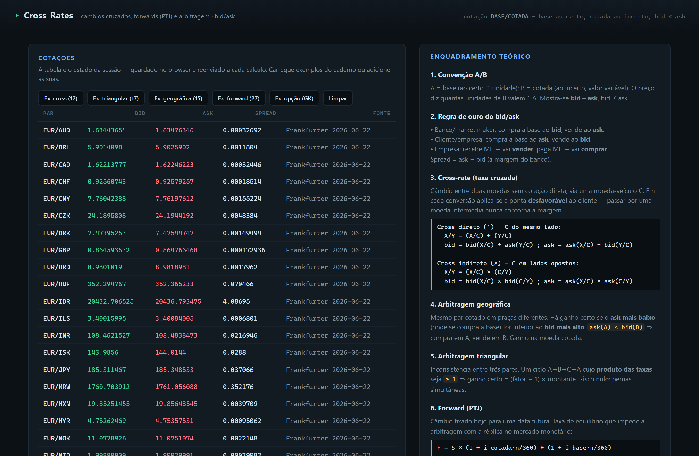
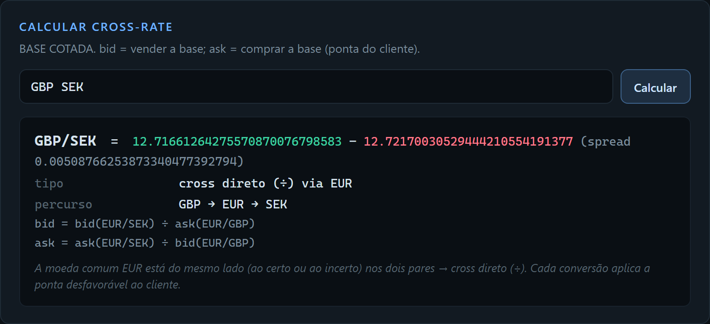
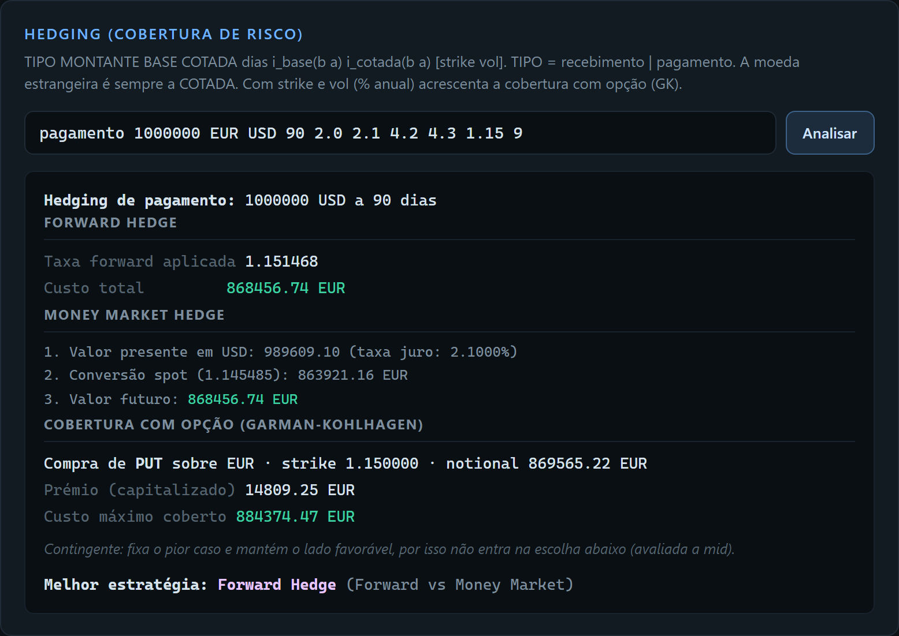

# cross-rates — FX Microstructure, CIP & Arbitrage Toolkit

[](https://github.com/amfranciscomarques-dot/cross-rates/actions/workflows/ci.yml)
[](LICENSE)


[](https://github.com/astral-sh/ruff)

> **A note on language.** This README is in English, but the code, tests and
> terminal UI are in European Portuguese (PT-PT) — my native language, and the
> language of the *International Finance* coursework whose solved exercises the
> tests are pinned to. Domain vocabulary maps one-to-one onto standard FX
> terms: `cotada` = quote currency, `prémio`/`desconto` = forward
> premium/discount, `arbitragem` = arbitrage, `taxa de juro` = interest rate.

A terminal and web toolkit for **foreign-exchange mathematics**: cross-rates
with full **bid/ask** microstructure, **covered interest parity** (CIP)
forwards with real day-count conventions, and **triangular / geographical /
term arbitrage** detection. Built to be read as a portfolio piece for Quant/FX
roles — every formula is anchored to a textbook result and locked by unit
tests.

> **Core thesis:** FX is graph traversal over a directed currency graph where
> every edge carries a two-sided quote, and arbitrage is simply a cycle whose
> product of edge weights exceeds 1. This project makes that thesis executable.

---

## Why this is not a toy currency converter

Most "currency converter" portfolio pieces take a single mid rate and divide.
Real FX has four properties this project models faithfully:

1. **Two-sided quotes** — every conversion applies the correct bid or ask leg;
   the customer always transacts on the unfavourable side.
2. **Decimal arithmetic** — the financial core uses Python's `Decimal`
   throughout; no binary float drift in multi-hop chains.
3. **Day-count conventions** — forward rates use Act/360 or Act/365 depending
   on the currency, the silent error that introduces ~1.4% systematic bias if
   ignored.
4. **Textbook-anchored tests** — every test cites the exercise it replicates
   (Madura, Shapiro, Eun & Resnick). Results are validated against an
   independent source, not just internally consistent.

---

## 1. Bid/ask microstructure & cross-rates

In the notation `BASE/QUOTE`, the **base** is *certain* (the "1") and the
**quote** is *uncertain* (the price). The quote says how many units of QUOTE
buy one unit of BASE, and always satisfies `bid <= ask`:

| Party         | Buys the base | Sells the base |
| ------------- | ------------- | -------------- |
| Market maker  | at the `bid`  | at the `ask`   |
| Customer      | at the `ask`  | at the `bid`   |

Each quote `BASE/QUOTE (bid b, ask a)` produces **two directed edges** in the
currency graph:

- `BASE → QUOTE` at rate `b` (sell 1 base, receive `b` quote)
- `QUOTE → BASE` at rate `1/a` (1 quote buys `1/a` base)

A cross-rate is a path traversal, and the two sides use *different* paths —
the one unfavourable to the customer at each hop:

```python
from cross_rates.nucleo import Cotacao, GrafoCambial, cross

g = GrafoCambial()
g.adicionar(Cotacao("EUR", "USD", "1.1574", "1.1576", "Paris"))
g.adicionar(Cotacao("GBP", "USD", "1.2500", "1.2510", "London"))

r = cross(g, "GBP", "EUR")
print(r.bid, "/", r.ask)   # 1.0798 / 1.0809  (GBP/EUR via USD)
print(r.bid_formula)       # bid = bid(GBP/USD) ÷ ask(EUR/USD)
```

The result is also labelled by type — direct, inverse, cross direct (÷), cross
indirect (×), or chain — reproducing the textbook rules automatically without
hardcoding them.

---

## 2. Triangular & geographical arbitrage

**Triangular arbitrage.** A 3-currency cycle `A→B→C→A` whose product of edge
rates (each on the correct bid/ask leg) **exceeds 1** is risk-free profit:

```
factor = ∏ rates(cycle) > 1   ⟹   profit = (factor − 1) × notional
```

```python
from cross_rates.nucleo import Cotacao, GrafoCambial, arbitragens_triangulares

g = GrafoCambial()
g.adicionar(Cotacao("EUR", "USD", "1.1574", "1.1576"))
g.adicionar(Cotacao("GBP", "USD", "1.2500", "1.2510"))
g.adicionar(Cotacao("GBP", "EUR", "1.1600", "1.1610"))  # mispriced

for a in arbitragens_triangulares(g):
    print(a.ciclo_texto, "factor =", a.fator, "P&L on 1m =", a.lucro(1_000_000))
```

**Geographical arbitrage.** The same pair quoted across venues (`fonte` field
on each `Cotacao`): profit exists iff `ask(venue A) < bid(venue B)` for
different venues. See `arbitragens_geograficas()`.

Both detectors accept an optional `limiar` (minimum threshold) to filter
sub-transaction-cost opportunities.

---

## 3. Covered Interest Parity (CIP) forwards

The forward rate prevents arbitrage between transacting the forward directly
and replicating it in the money market. For pair `BASE/QUOTE` over `n` days:

```
F = S × (1 + i_quote · n / n_q) / (1 + i_base · n / n_b)
```

where `n_b`, `n_q` are the **day-count bases** of each currency.

### Day-count conventions

`ConvencaoDia` encodes the two conventions that dominate FX money markets:

- **Act/360** ("Eurobasis") — USD, EUR, JPY, CHF, CAD, SEK, …
- **Act/365** ("Sterling basis") — GBP, AUD, NZD

The convention is inferred from the currency automatically:

```python
from cross_rates.nucleo import TaxaJuro

TaxaJuro.de_moeda("GBP", "5.0", "5.1").convencao   # Act/365
TaxaJuro.de_moeda("USD", "4.9", "5.0").convencao   # Act/360
```

### Bid/ask forward pricing

Each side combines the money-market legs unfavourable to the customer:

```
F_bid = S_bid · (1 + i_bid,quote · n/n_q) / (1 + i_ask,base · n/n_b)
F_ask = S_ask · (1 + i_ask,quote · n/n_q) / (1 + i_bid,base · n/n_b)
```

```python
from cross_rates.nucleo import Cotacao, TaxaJuro, forward

spot = Cotacao("CHF", "USD", "1.2700", "1.2705")
f = forward(spot,
            TaxaJuro("CHF", "0.1072", "0.1144"),
            TaxaJuro("USD", "4.9379", "4.9438"),
            180)
print(f.bid, "/", f.ask, f.sinal)   # 1.3006 / 1.3012  prémio
```

- If `i_quote > i_base`: `F > S` (base trades at a **forward premium**).
- If `i_quote < i_base`: `F < S` (base trades at a **forward discount**).

### Covered interest arbitrage

When the market-quoted forward falls outside the parity band, term arbitrage
is available. See `arbitragem_a_prazo()`.

### FX swaps

A swap outright reconstructed from spot and swap points, respecting the
premium/discount rule (`points_bid < points_ask` → premium, add; the reverse
→ discount, subtract):

```python
from cross_rates.nucleo import Cotacao, outright_de_pontos

sw = outright_de_pontos(Cotacao("EUR", "USD", "1.1500", "1.1510"), "20", "30")
print(sw.fwd_bid, sw.fwd_ask, sw.sinal)   # 1.1520 1.1540 prémio
```

---

## 4. Hedging foreign-currency exposure

For a future payment or receipt in a foreign (quote) currency, two hedges
replicate each other — and **the theorem is that they must**:

- **Forward hedge** — lock the forward rate today.
- **Money-market hedge (MMH)** — borrow/lend, convert spot, lend/borrow to
  replicate the forward synthetically.

In a frictionless market they are mathematically identical; this identity
**is** covered interest parity. With bid/ask spreads they diverge by a few
basis points, and the cheaper one is chosen:

```python
from cross_rates.nucleo import Cotacao, TaxaJuro, analisa_hedging

spot = Cotacao("EUR", "USD", "1.0850", "1.0852")
h = analisa_hedging(
    "pagamento", 1_000_000, spot,
    TaxaJuro("EUR", "2.0", "2.1"), TaxaJuro("USD", "4.2", "4.3"), 90,
)
print(h.fwd_resultado_base, h.mmh_resultado_base, h.melhor_estrategia)
# forward cost ≈ MMH cost ≈ EUR 916,870.55  (CIP holds)
```

Each leg of the MMH applies the correct bid/ask side depending on whether the
exposure is a payment or a receipt.

### Optional: option hedge (third strategy)

Pass `opcao_strike` and `vol` to add a **contingent** hedge alongside the two
above. A payment buys a *put* on the base, a receipt a *call*, sized at
`montante / strike` of base so exercise converts the exposure exactly. The
option fixes a worst case — a **maximum cost** (payment) or a **minimum
proceeds** (receipt) — while keeping the favourable side, paid for with the
premium (Garman-Kohlhagen, financed to maturity at the base rate):

```python
h = analisa_hedging(
    "pagamento", 1_000_000, spot,
    TaxaJuro("EUR", "2.0", "2.1"), TaxaJuro("USD", "4.2", "4.3"), 90,
    opcao_strike="1.0850", vol="0.09",
)
print(h.opcao_tipo, h.opcao_resultado_base)   # 'put', EUR max cost incl. premium
```

Because it is contingent, the option **does not enter** `melhor_estrategia`
(which stays a forward-vs-MMH choice). The exercise leg `montante / strike` is
exact; the option leg is valued at mid (the GK price is itself a mid concept)
and labelled as such, leaving the exact bid/ask forward and MMH rows untouched.

---

## Install

```bash
pip install -e "."          # core + Textual TUI
pip install -e ".[web]"     # + FastAPI web UI
pip install -e ".[dev]"     # + test / lint / type-check tooling
```

Requires Python ≥ 3.11.

---

## Terminal UI

```bash
python -m cross_rates       # or: cross-rates
```

A [Textual](https://github.com/Textualize/textual) interface covering every
feature above: add quotes (`EUR USD 1.1574 1.1576 Paris`), compute crosses,
run triangular / geographical / term arbitrage, price forwards with
day-count-aware rates, and inspect a theory panel (`t`).

Key shortcuts: `e` load cross examples · `x`/`g`/`f` arbitrage & forward
examples · `l` clear · `q` quit.

---

## Web UI

```bash
cross-rates-web             # starts uvicorn on http://127.0.0.1:8000
```

A stateless FastAPI + Jinja2 + [htmx](https://htmx.org) interface. The
browser holds the quote table in hidden form fields and re-sends them with
each operation; the server rebuilds the `GrafoCambial` on every request and
returns an HTML fragment that htmx swaps in-place. No JavaScript framework,
no client-side state.

The page opens **pre-seeded with live ECB reference rates** (Frankfurter feed):



A cross-rate carries its path, bid/ask formulas, and a methodological note:



Hedging compares forward vs. money-market, plus an optional **option hedge**
(Garman-Kohlhagen) that fixes the worst case while keeping the upside:



Available operations via the UI: add / clear quotes, load example sets, compute
cross-rates, run arbitrage (triangular + geographical), price forwards (with
optional market forward for covered arbitrage detection), compute swap
outrights, and compare forward vs. money-market hedging strategies.

---

## Architecture

```
cross_rates/
  nucleo/        # pure FX math, no I/O — the type-checked, tested core
    cotacao.py   # Cotacao: pair, bid, ask, source venue; Numerico type alias
    grafo.py     # GrafoCambial: currency nodes, directed edges, BFS path-finding
    cross.py     # cross(): synthetic cross-rate, path classification, formulas
    arbitragem.py  # triangular + geographical arbitrage as graph cycles
    forward.py   # CIP forward, ConvencaoDia (Act/360 / Act/365), term arbitrage
    swaps.py     # FX swap outright from spot + swap points
    hedging.py   # forward hedge vs. money-market hedge (CIP replication)
  servico/       # serialization, formatting, shared operation layer (typed)
  tui/           # Textual TUI — thin adapter over nucleo + servico
  web/           # FastAPI + Jinja2 + htmx web UI — thin adapter over the same
testes/          # pytest suite pinned to textbook exercises + property tests
```

**Design rule:** all FX math is pure and `Decimal`-based in `nucleo/`, with
zero I/O. `servico/` is the typed, I/O-free shared layer that both UIs call.
Neither `tui/` nor `web/` contains financial logic.

---

## Tests, types, lint

```bash
pytest                  # full suite with coverage (100% gate on nucleo + servico)
ruff check .            # lint + import sorting
mypy cross_rates/nucleo cross_rates/servico   # strict type-check on the core
```

- `mypy --strict` on the financial core and service layer.
- `pytest --cov` with a 100% coverage gate on `nucleo/` and `servico/`.
  The TUI is integration-tested separately and excluded from the line-coverage
  gate (Textual's async event loop makes line coverage a poor signal there).
- Every test in `testes/` cites the exercise it replicates (Ex. 10, 21b, 27c,
  …); results are compared against textbook answers within a 0.01% relative
  tolerance.

---

## Roadmap

See [PLAN.md](PLAN.md) for the full phased plan. The next two milestones are:

- **Live price feed** — pluggable adapter seeding the graph with real FX
  quotes (Frankfurter API as the reference implementation).
- **Public deployment** — Fly.io deploy so the web UI is usable without a
  local install.

---

## References

- Madura, *International Financial Management* — money-market hedge, arbitrage.
- Shapiro, *Multinational Financial Management* — CIP, covered arbitrage.
- Eun & Resnick, *International Financial Management* — day-count conventions,
  cross-rate microstructure.
